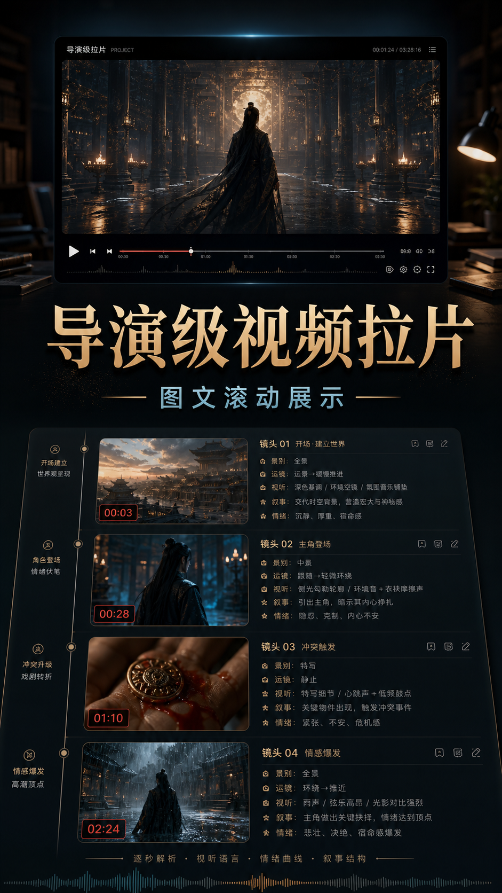

# Director Lapian Skill

导演级视频拉片 Skill，用于对本地视频、短片、广告、MV、预告片或分镜素材做专业拆解，产出图文逐秒/自适应拉片报告、专业导演分析、源片风格圣经，以及“上半屏视频播放 + 下半屏图文报告滚动”的展示视频。

## 能做什么

- 本地视频证据准备：抽帧、音频提取、音量分析、镜头切分。
- 导演级拉片报告：叙事结构、视听语言、镜头调度、表演情绪、主题策略。
- 图文逐秒报告：保留抽帧图片、时间戳、节点记录和声音/字幕说明。
- 专业导演分析：解释为什么这样拍、观众心理如何被调动、创作者能学什么。
- 源片风格圣经：把源片视觉风格整理成可迁移的 AI 创作资产。
- 展示视频生成：将原视频和带图片的 Markdown 报告合成竖屏滚动展示视频。

## 效果预览

交流群二维码：


封面图：



图文滚动展示视频预览：


## 目录结构

```text
.
├── SKILL.md
├── agents/
├── references/
├── requirements.txt
└── scripts/
```

安装 Python 依赖：

```bash
python -m pip install -r requirements.txt
```

## 常用命令

准备拉片证据：

```bash
python scripts/prepare_lapian_evidence.py path/to/video.mp4 --out-root 08拉片输出 --project-name 片名 --task-name 导演级拉片 --interval 1
```

生成“上视频、下图文报告滚动”的展示视频：

```bash
python scripts/make_lapian_showcase_video.py --project-dir 08拉片输出/YYYYMMDD/片名_导演级拉片
```

最终交付检查：

```bash
python scripts/qa_lapian_delivery.py --project-dir 08拉片输出/YYYYMMDD/片名_导演级拉片 --overwrite-out --strict
```

## 依赖

- Python 3.10+
- FFmpeg / ffprobe
- Pillow
- python-docx（用于 DOCX 转换）
- PyMuPDF（用于 PDF 预览）
- faster-whisper（仅启用可选 ASR 时需要；可能下载语音识别模型）

生成长图、展示视频或 PDF 时需要支持中文的字体。脚本会自动搜索 Windows 的微软雅黑/黑体、macOS 的苹方/冬青黑体，以及 Linux 的 Noto Sans CJK/文泉驿字体。若系统字体不在常见位置，使用 `--font PATH` 明确指定 TTF、TTC 或 OTF 文件：

```bash
python scripts/make_lapian_showcase_video.py --project-dir path/to/project --font path/to/NotoSansCJK-Regular.ttc
python scripts/md_lapian_preview_pdf.py path/to/report.md --out path/to/preview.pdf --font path/to/NotoSansCJK-Regular.ttc
```

## 说明

本仓库只包含 Skill 指令、参考规则和脚本，不包含任何私有视频、抽帧图片、音频、报告成品或账号凭据。

## License

MIT
